# Tugas 4
## Ketentuan Membaca Format dan Daftar Fitur
```
PROTOCOL FORMAT

KETENTUAN MEMBACA FORMAT
string terbagi menjadi 2 bagian, dipisahkan oleh enter
ENTER COMMAND : (perintah)
ENTER NAMEFILE : (nama file)

FITUR

- upload : untuk membuat file yang dikirim oleh client
  request : upload
  parameter : nama file
  response : berhasil -> OK
             gagal -> ERROR

- list : untuk melihat daftar record
  request: list
  parameter: tidak ada
  response: daftar file yang ada

- download : untuk mencari file berdasar nama yang akan dikirimkan ke client
  request: download
  parameter: nama file yang dicari
  response: file yang dicari

- jika command tidak dikenali akan merespon dengan ERRCMD
```

## Cara Melakukan Request & Respon yang Didapat

- Sebelum menjalankan client jalankan **server_thread_file.py** terlebih dahulu
 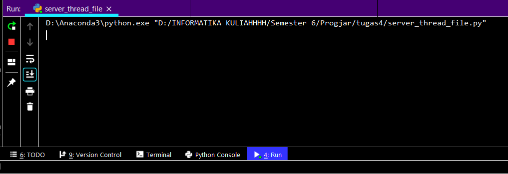

- Jalankan **client.py** dan masukkan perintah sesuai fitur yang tersedia
 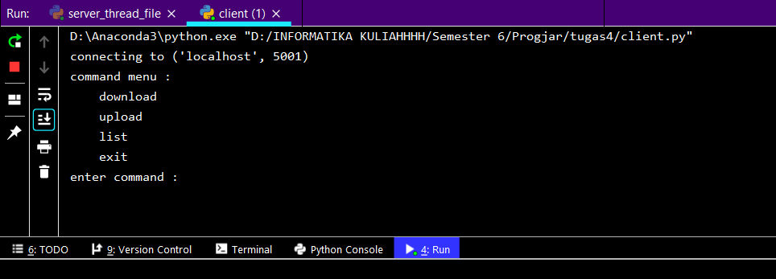
### Meletakkan File (Upload)

- Pada **client.py** masukkan perintah **upload**
  
  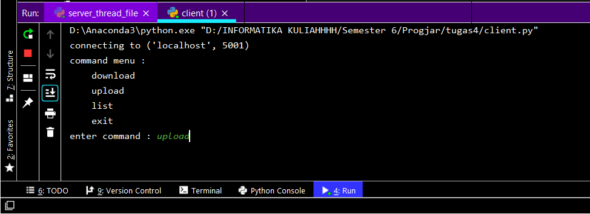
  
- Masukkan nama file yang ingin diupload ke **File Server**

  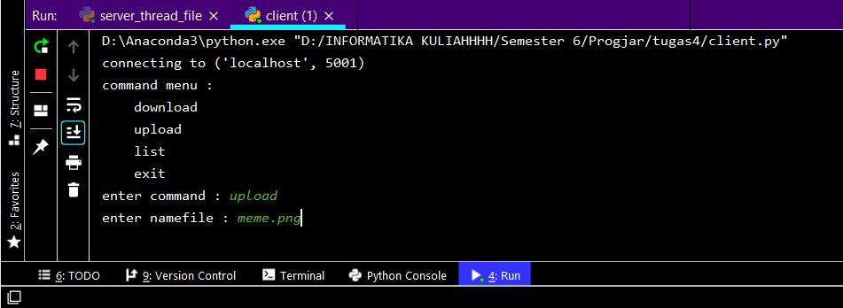
  
- Berikut respon yang didapat jika file berhasil diupload

  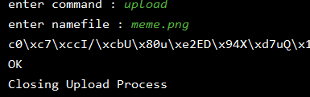
  
- Dapat dilihat bahwa file yang bersangkutan sudah berada di dalam direktori File Server

  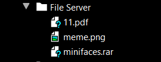

### Mengambil File (Download) 

- Pada **client.py** masukkan perintah **download**
  
  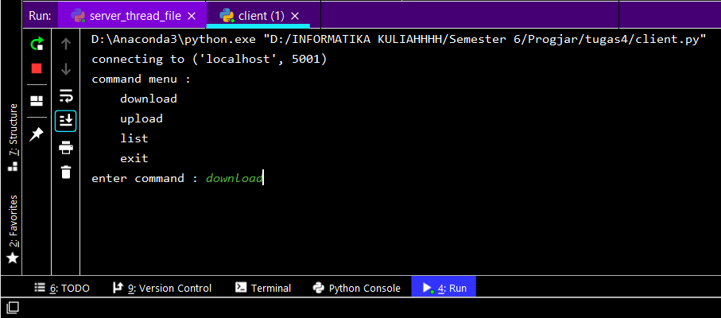
  
- Masukkan nama file yang ingin didownload ke **File Client**

  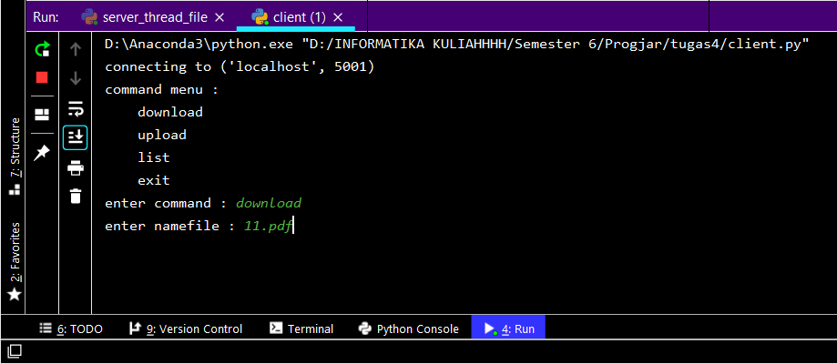
  
- Berikut respon yang didapat jika file berhasil didownload

  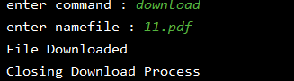
  
- Dapat dilihat bahwa file yang bersangkutan sudah berada di dalam direktori **File CLient**

  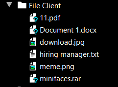

### Melihat Daftar File (List)

- Pada **client.py** masukkan perintah **list**
  
  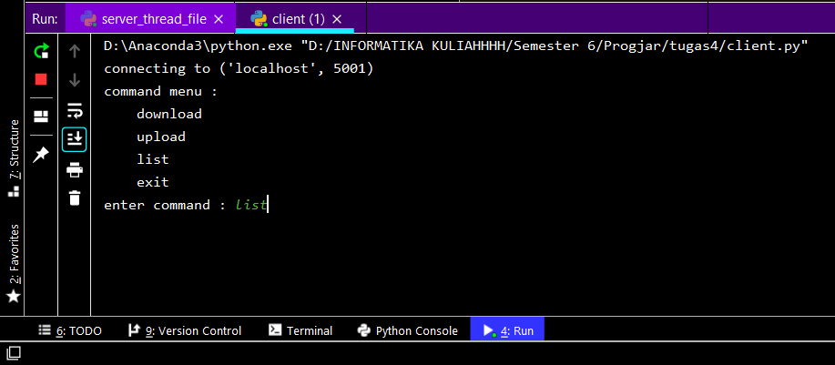
  
- Client akan mengirimkan string bebentuk json ke server, setelah mendapat balasan dari server maka client akan menampilkan list lalu server akan menerima string berbentuk json dan mengirimkan balasan ke client untuk menampilkan list
- Hasilnya adalah sebagai berikut
  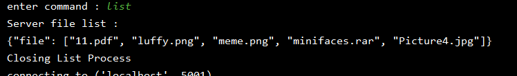
